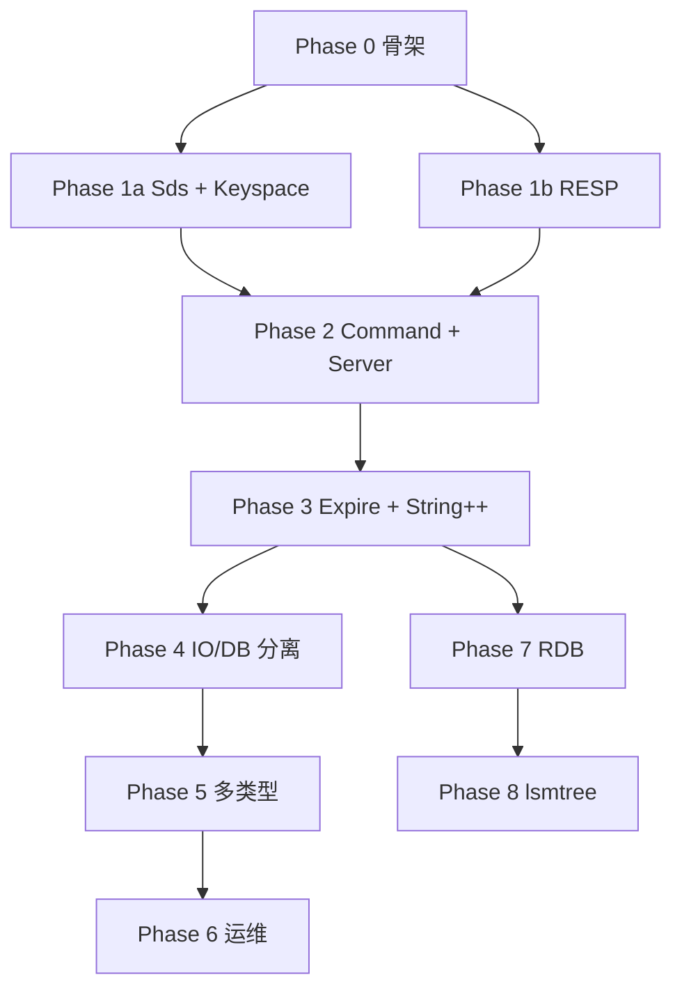

# Ledis 实现顺序

> **状态**：Phase 0–7 已完成；AOF-lite、Key 命令扩展、SELECT 修复已合并  
> **功能清单**：[features.md](./features.md) · **配置说明**：[configuration.md](./configuration.md)  
> **原则**：依赖自底向上；每阶段可独立编译、测试、合并；不并行写未冻结接口的模块。

---

## 1. 总览

```
Phase 0  文档 + 协议约定(protocol.md) + CMake 骨架
   ↓
Phase 1  Protocol(RESP) 优先 → Store(Sds) → 二者单测
   ↓
Phase 2  Command + 单线程 Server MVP（redis-cli PING/GET/SET）
   ↓
Phase 3  过期 + SELECT + 更多 String 命令 + Pipeline
   ↓
Phase 4  IO/DB 分离 + 性能基准 + maxclients/限流
   ↓
Phase 5  Hash / List 基础类型
   ↓
Phase 6  AUTH + INFO + 运维命令
   ↓
Phase 7  持久化（RDB-lite）
   ↓
Phase 8  lsmtree 集成（可选）
```

**预估**：Phase 0–3 为 **MVP 关键路径**；Phase 4 起为生产化与功能扩展。

---

## 2. 阶段依赖图



---

## 3. Phase 0 — 架构准备

**目标**：冻结接口，建立空目录与构建入口，零业务逻辑。

| # | 任务 | 产出 |
|---|------|------|
| 0.1 | 创建 `docs/ledis/` 文档 | architecture / layer_contracts / 本文 |
| 0.2 | 创建 `ledis/include` 骨架头文件 | 空类声明，与 layer_contracts 一致 |
| 0.3 | `ledis/CMakeLists.txt` | 空静态库目标可链接 |
| 0.4 | 根 `CMakeLists.txt` 增加 `option(LEDIS_BUILD)` | 默认 OFF，不影响现有构建 |
| 0.5 | `tests/ledis/` 占位 `test_skeleton.cc` | CTest `Ledis.skeleton` 通过 |

**验收**：

```bash
cmake -B build -DLEDIS_BUILD=ON -DLEMONETTYCORE_BUILD=ON
cmake --build build --target ledis_skeleton_test
ctest -R Ledis.skeleton
```

**不写**：任何 RESP / store 实现。

---

## 4. Phase 1 — 协议优先，再存储

**目标**：按 [protocol.md](./protocol.md) 实现 RESP 解析/编码并单测；再实现 Sds/Keyspace。仍无网络。

> **顺序调整**：协议是线上字节的唯一权威来源，**先** Phase 1b 再 Phase 1a（Bulk 解析可暂用 `std::string`，接入 Store 前换 Sds）。

### Phase 1b — Protocol（RESP2）【先做】

### Phase 1b — Protocol（RESP2）【先做】

| # | 任务 | 文件 |
|---|------|------|
| 1b.1 | 阅读并冻结 [protocol.md](./protocol.md) | — |
| 1b.2 | `RespValue` | `protocol/resp_value.*` |
| 1b.3 | `RespReader` 增量解析 | `protocol/resp_reader.*` |
| 1b.4 | `RespWriter` | `protocol/resp_writer.*` |
| 1b.5 | 测试向量 §10 | `tests/ledis/protocol/test_resp_reader.cc` `test_resp_writer.cc` |

**测试用例必须覆盖**（与 protocol.md §10 一致）：

- 单帧 `*2\r\n$3\r\nGET\r\n$3\r\nfoo\r\n`
- 半包：分三次 append
- 粘包：GET + PING 两帧
- GET 命中/未命中编码
- 非法帧：`-ERR protocol error`

**验收**：`ctest -R '^Ledis.protocol'` 全绿。

### Phase 1a — Store（String only）【后做】

| # | 任务 | 文件 |
|---|------|------|
| 1a.1 | `Sds` 实现 | `store/sds.h` `.cc` |
| 1a.2 | `LedisObject`（仅 kString/kRaw） | `store/object.*` |
| 1a.3 | `Keyspace` dict + get/set/del/exists | `store/keyspace.*` |
| 1a.4 | `DBManager` 16 DB + select | `store/db_manager.*` |
| 1a.5 | 单元测试 | `tests/ledis/store/test_sds.cc` `test_keyspace.cc` |

**验收**：`ctest -R '^Ledis.store'` 全绿。

**CMake 目标**：`ledis_protocol`、`ledis_store`（STATIC）。

---

## 5. Phase 2 — 命令层 + MVP 服务端

**目标**：`redis-cli` 可 `PING`、`SET`、`GET`、`DEL`。

| # | 任务 | 说明 |
|---|------|------|
| 2.1 | `Command` / `CommandRegistry` | 注册表 + dispatch |
| 2.2 | Handlers: PING, GET, SET, DEL, EXISTS | 调用 DBManager |
| 2.3 | `CommandQueue` 同步版 | 单线程直接调用 store |
| 2.4 | `Session::run` | ChainBuffer + RespReader + dispatch + send |
| 2.5 | `LedisServer` | 加载 YAML，`TcpServer` + `Runtime(1)` |
| 2.6 | `ledis-server` 可执行文件 | 输出到 `bin/Ledis/` |
| 2.7 | 配置 `ledis.single_thread_mode: true` | 默认开启 |
| 2.8 | 集成测试 | 脚本或 CTest 启动 server + redis-cli |

**配置 fixture**：`tests/ledis/fixtures/ledis_mvp.yaml`（port 16379 避免冲突）。

**验收**：

```bash
./bin/Ledis/ledis-server tests/ledis/fixtures/ledis_mvp.yaml &
redis-cli -p 16379 PING          # → PONG
redis-cli -p 16379 SET foo bar   # → OK
redis-cli -p 16379 GET foo       # → bar
redis-cli -p 16379 DEL foo       # → (integer) 1
ctest -R '^Ledis.integration.mvp'
```

**CMake 目标**：`ledis_command`、`ledis_session`、`ledis_server`（EXECUTABLE）。

---

## 6. Phase 3 — 过期 + 多 DB + String 增强

**目标**：行为更接近 Redis 常用子集。

| # | 任务 | 命令/能力 |
|---|------|-----------|
| 3.1 | `ClientContext` + SELECT | SELECT |
| 3.2 | Keyspace 过期字段 + 惰性删除 | GET 时清理 |
| 3.3 | `ActiveExpireCycle` + Timer | EXPIRE, TTL, PERSIST |
| 3.4 | DBSIZE, FLUSHDB | |
| 3.5 | MGET, MSET | |
| 3.6 | INCR, INCRBY, DECR, DECRBY | kRaw string 解析整数 |
| 3.7 | Pipeline 测试 | 一次 send 多命令，顺序响应 |
| 3.8 | `query_buffer_limit` | 超限断开 |

**验收**：

```bash
redis-cli -p 16379 SELECT 1
redis-cli -p 16379 SET key1 val EX 10
redis-cli -p 16379 TTL key1
# Pipeline 脚本测试
ctest -R '^Ledis\.(store|command|integration)'
```

---

## 7. Phase 4 — IO/DB 分离与性能

**目标**：默认 `single_thread_mode: false`，提升多连接场景吞吐。

| # | 任务 | 说明 |
|---|------|------|
| 4.1 | 独立 `DB Runtime`（threads=1） | 仅跑 CommandQueue 消费 |
| 4.2 | IO Runtime（threads=N） | Session 协程 |
| 4.3 | `CommandQueue` MPSC 实现 | IO 投递，DB 消费 |
| 4.4 | `maxclients` 连接上限 | 超限拒绝 |
| 4.5 | 集成 `kv_pool` | Sds / Object 小对象分配 |
| 4.6 | 基准脚本 | `redis-benchmark -t ping,get,set -p 16379 -n 10000` |

**验收**：

- 功能回归：`ctest -R '^Ledis'` 全绿
- 相对 Phase 2 单线程，多连接 QPS 不下降（记录 baseline 写入 `bench_results/`）

**风险缓冲**：若 MPSC 复杂度高，可先 **Fiber 邮箱**（每 IO 线程一条单生产者队列）。

---

## 8. Phase 5 — 多数据类型

**目标**：扩展 `LedisObject` 与命令，仍保持单 DB 线程。

| # | 类型 | 命令（最小集） |
|---|------|----------------|
| 5.1 | Hash | HSET, HGET, HDEL, HGETALL, HLEN |
| 5.2 | List | LPUSH, RPUSH, LPOP, RPOP, LLEN, LRANGE |
| 5.3 | Set | SADD, SREM, SMEMBERS, SCARD, SISMEMBER |
| 5.4 | WRONGTYPE 错误 | 类型不匹配统一错误 |

**实现顺序（类型内部）**：Hash → List → Set（与 Redis 使用频率接近）。

**容器选型**：

| 类型 | 结构 |
|------|------|
| Hash | `lstl::unordered_map<Sds,Sds>` |
| List | `lstl::deque<Sds>` |
| Set | `lstl::unordered_set<Sds>` |

**验收**：每类型独立 `tests/ledis/store/test_*` + `redis-cli` 集成。

---

## 9. Phase 6 — 安全与运维

| # | 任务 | 命令 |
|---|------|------|
| 6.1 | `requirepass` | AUTH |
| 6.2 | 未 AUTH 拦截 | 除 AUTH/PING 外 NOAUTH |
| 6.3 | INFO section | INFO server, INFO memory |
| 6.4 | CONFIG GET 只读项 | port, db_count, maxmemory |
| 6.5 | 优雅退出 | SIGINT/SIGTERM → stop accept → drain |

---

## 10. Phase 7 — 持久化（RDB-lite）

| # | 任务 | 说明 |
|---|------|------|
| 7.1 | `SnapshotWriter` 遍历 dict | 自定义简单格式或 RESP 序列 |
| 7.2 | `LoadSnapshot` 启动加载 | |
| 7.3 | SAVE / BGSAVE（协程后台） | BGSAVE 在 DB 线程外需注意快照一致性（Copy-on-write 或 brief lock） |
| 7.4 | 配置 `dir` / `dbfilename` | |

**验收**：重启后 key 仍在；`tests/ledis/integration/test_rdb_restart.cc`。

---

## 11. Phase 8 — lsmtree 集成（可选）

**前置**：Phase 7 稳定；存储团队对齐 record 编码。

| # | 任务 |
|---|------|
| 8.1 | `LedisEngine` 抽象：`MemoryEngine` / `LsmEngine` |
| 8.2 | WAL 写透或异步刷盘 |
| 8.3 | 与 `module/storage/lsmtree` 对接 |

**非 MVP 关键路径**；可在 Phase 7 后按需启动。

---

## 12. 每阶段合并检查清单

每个 Phase 合并前必须满足：

- [ ] 本阶段所有 CTest 通过
- [ ] 未破坏 `LemoNettyCore` / `lstl` 现有测试（`ctest` 全量或 CI 子集）
- [ ] 新增公开 API 已更新 [layer_contracts.md](./layer_contracts.md)
- [ ] 若改配置项，更新 `tests/ledis/fixtures/*.yaml` 示例
- [ ] 无 `ledis-store` → socket 反向依赖

---

## 13. 文件创建顺序（开发视角）

按 **单人串行** 推荐的开文件顺序：

```
1.  ledis/.../protocol/resp_value.h
2.  ledis/.../protocol/resp_reader.*
3.  tests/ledis/protocol/test_resp_reader.cc
4.  ledis/.../protocol/resp_writer.*
5.  tests/ledis/protocol/test_resp_writer.cc
6.  ledis/include/ledis/store/sds.h
7.  ledis/src/store/sds.cc
8.  tests/ledis/store/test_sds.cc
9.  ledis/.../object.*
10. ledis/.../keyspace.*
11. tests/ledis/store/test_keyspace.cc
12. ledis/.../db_manager.*
13. ledis/.../command/registry.*
14. ledis/.../command/handlers/string_basic.*
15. tests/ledis/command/test_ping.cc
16. ledis/.../session/session.*
17. ledis/.../server/ledis_server.*
18. tests/ledis/fixtures/ledis_mvp.yaml
19. tests/ledis/integration/test_mvp.cc
20. （Phase 3+）expire, select, pipeline, ...
```

---

## 14. CMake 引入顺序

```cmake
# ledis/CMakeLists.txt 建议顺序
add_subdirectory 或 add_library:
  ledis_store      # Phase 1a
  ledis_protocol   # Phase 1b
  ledis_command    # Phase 2  → 依赖 store + protocol
  ledis_session    # Phase 2  → 依赖 command + lemo_nettycore
  ledis_server     # Phase 2  → executable
```

根目录：

```cmake
option(LEDIS_BUILD "构建 Ledis Redis 兼容 KV 服务" OFF)
if(LEDIS_BUILD)
  if(NOT LEMONETTYCORE_BUILD)
    message(FATAL_ERROR "Ledis 需要 LEMONETTYCORE_BUILD=ON")
  endif()
  add_subdirectory(ledis)
endif()
```

---

## 15. 里程碑与交付物

| 里程碑 | Phase | 交付物 | 演示 |
|--------|-------|--------|------|
| M0 | 0 | 文档 + 空构建 | cmake 通过 |
| M1 | 1 | store + protocol 单测 | ctest Ledis.store/protocol |
| **M2 MVP** | **2** | **ledis-server** | **redis-cli PING/GET/SET** |
| M3 | 3 | 过期 + SELECT + Pipeline | redis-cli EXPIRE/TTL |
| M4 | 4 | 多 IO 线程 | redis-benchmark |
| M5 | 5 | Hash/List/Set | redis-cli HSET/LPUSH |
| M6 | 6 | AUTH + INFO | 带密码连接 |
| M7 | 7 | RDB | 重启恢复 |
| M8 | 8 | lsmtree | 可选 |

---

## 16. 建议的下一步

1. **确认** [protocol.md](./protocol.md)（RESP 类型、命令帧、响应映射、测试向量）  
2. Phase 0：`ledis/` 目录 + `LEDIS_BUILD` + CMake 骨架  
3. Phase 1b：`RespReader` / `RespWriter` + `tests/ledis/protocol/`（**第一个写代码的模块**）  
4. Phase 1a：`Sds` + `Keyspace`  

协议与存储均单测通过后再接 Phase 2 `ledis-server`。

---

## 17. 参考

- [architecture.md](./architecture.md)
- [layer_contracts.md](./layer_contracts.md)
- [docs/net/roadmap.md](../net/roadmap.md) — 分阶段写法参考
