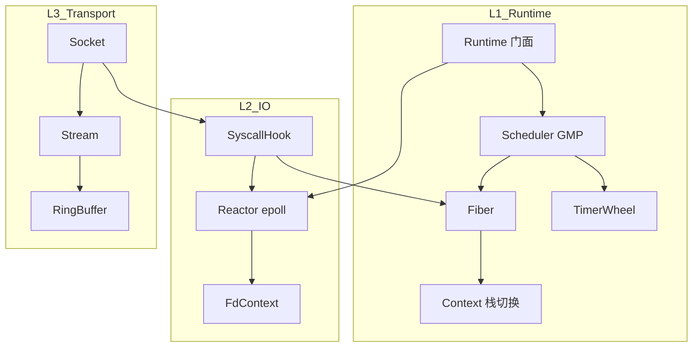

# 协程网络库总体架构

## 1. 背景：为什么要重做

当前仓库存在两套并行实现，均有明显架构缺陷：

| 来源 | 主要问题 |
|------|----------|
| `module/net` | `IOManager → Scheduler → TimerManager` 深层继承形成 God Class；`net_log` 命名误导；日志与运行时强耦合；`ucontext` 已弃用；缺少 Server 层，业务需手写 accept/schedule |
| `sylar/` | 全局 `fibers_` 队列锁竞争；`Ringbuffer` 实为 muduo 线性 buffer；拼写/API 历史包袱；117 文件未接入 CMake；文档路径 `third_party/sylars/` 与实际 `sylar/` 不一致 |

**目标**：在 `module/net` 内按本架构**逐层重写**，`sylar/` 仅作只读对照，不再维护。

---

## 2. 设计目标

1. **组合优于继承**：调度、定时器、IO 多路复用各自独立，由 `Runtime` 门面组装。
2. **单向依赖**：上层可依赖下层，禁止反向或环依赖。
3. **协程一等公民**：阻塞 syscall 在 IO 线程 + hook 开启时自动 yield；同步原语（mutex/sem/channel）协程安全。
4. **可测试**：每层可独立单测，不启动完整网络栈。
5. **可演进**：Context 实现可替换（`ucontext` → `fcontext`/汇编），Transport/Server 可后接 HTTP/RPC。
6. **日志正交**：`log` 子系统不进入 `runtime/io` 依赖链，通过宏/注入使用。

---

## 3. 分层架构

```
┌──────────────────────────────────────────────────────────────────┐
│ L4  Server        Acceptor · TcpServer · WorkerGroup               │
├──────────────────────────────────────────────────────────────────┤
│ L3  Transport     Socket · Stream · Address · RingBuffer/ByteArray│
├──────────────────────────────────────────────────────────────────┤
│ L2  IO            Reactor(epoll) · FdContext · SyscallHook        │
├──────────────────────────────────────────────────────────────────┤
│ L1  Runtime       Runtime(facade) · Scheduler · Fiber · Timer    │
│                   Sync: FiberMutex · FiberSemaphore · FiberLocal   │
├──────────────────────────────────────────────────────────────────┤
│ L0  Base          Thread · Mutex · Semaphore · Util · Config     │
├──────────────────────────────────────────────────────────────────┤
│ ⊥   Log（正交）    Logger · AsyncSink — 仅被各层通过宏/接口引用    │
└──────────────────────────────────────────────────────────────────┘
```

### 3.1 依赖规则

```
L4 → L3 → L2 → L1 → L0
Log ⊥ 所有层（不反向依赖 runtime/io）
```

CMake OBJECT 库建议：

| OBJECT 目标 | 目录 | 依赖 |
|-------------|------|------|
| `net_base_obj` | `base/` | Threads, yaml-cpp |
| `net_runtime_obj` | `runtime/` | net_base_obj |
| `net_io_obj` | `io/` | net_runtime_obj, dl |
| `net_transport_obj` | `transport/` | net_io_obj |
| `net_server_obj` | `server/` | net_transport_obj |
| `net_log_obj` | `log/` | net_base_obj（**不**依赖 io/runtime） |
| `net` (STATIC) | 合并 runtime+io+transport+server | |
| `net_full` (可选) | net + net_log | 应用一站式链接 |

构建开关：`LSTL_BUILD_NET`（替代 `LSTL_BUILD_NET_LOG`），别名 `net::net`。

---

## 4. 核心组件关系



**关键变化（相对旧实现）**：

- `IOManager` 拆为 **`Reactor`**（只管 epoll 事件）+ **`Runtime`**（持有 Scheduler 与 Reactor，在 `idle()` 中 `epoll_wait`）。
- `Scheduler` **不再继承** `TimerManager`；定时器作为成员组合。
- `Fiber` 通过 **`Context`** 抽象栈切换，与调度器解耦。

---

## 5. 线程与调度模型

### 5.1 物理线程（M）

- 每个 `Runtime` 拥有 `N` 个 **Processor**（pthread），每线程一个 **主协程**（无独立栈，跑调度循环）。
- `thread_local` 保存：`Processor*`, `Fiber*`, `Runtime*`, `hook_enable`。

### 5.2 协程（G）

- 子协程有独立栈（默认 128KB，可配置）。
- 状态机：`INIT → READY → EXEC → HOLD → TERM`（`EXCEPT` 用于未捕获异常）。
- `YieldToReady` / `YieldToHold`：标准让出点；`SleepMs` 注册定时器后 yield。

### 5.3 调度器（P）

- 每 Processor 一个 **本地环形队列**（容量 256）+ 全局溢出队列。
- 工作窃取：空闲 P 从其他 P 队列尾部偷任务。
- **Runnext**：刚 yield 的 G 优先在下一轮同 P 执行（减少缓存失效）。
- `schedule(fiber|callback, pin_thread=-1)`：可绑核到指定 pthread。

### 5.4 IO 与调度协作

```
协程 read(fd) 
  → hook 拦截 
  → FdContext 注册 READ 事件 + 当前 Fiber 挂到 Reactor
  → Fiber::YieldToHold()
  → Processor idle: Reactor::poll(timeout) 
  → 事件就绪 → 唤醒 Fiber → schedule(READY)
```

`Reactor::poll` 的超时由 **TimerWheel** 最近到期时间决定，保证 sleep/timer 与 IO 同一条 `epoll_wait` 路径。

---

## 6. Syscall Hook 边界

| 规则 | 说明 |
|------|------|
| 生效条件 | `thread_local hook_enable == true` 且当前为子协程 |
| 覆盖范围 | sleep/usleep/nanosleep, read/write/readv/writev, recv/send, connect, accept, close, fcntl 部分 |
| 不 hook | 文件 IO（非 socket fd）、纯计算、已 epoll 化的自定义路径 |
| 超时 | socket 超时从 `FdContext` 读取；connect 统一走 hook + `SO_SNDTIMEO` 或定时器 |
| 关闭 | `close(fd)` 必须取消 Reactor 上全部事件，防止悬挂 Fiber |

Hook 通过 `dlsym(RTLD_NEXT)` 获取原始符号，**单一 connect 路径**，删除独立的 `connectWithTimeout` 旁路。

---

## 7. 目录布局（目标）

```
module/net/
├── net.h                    # 应用总入口（runtime + transport + server）
├── CMakeLists.txt
├── base/
│   ├── thread/              # Thread, Mutex, Semaphore, Noncopyable
│   ├── common/              # util, endian, singleton
│   └── config/              # ConfigCenter, ConfigVar
├── runtime/
│   ├── context.h / .cc      # 栈切换抽象（Phase1: ucontext, Phase2: fcontext）
│   ├── fiber.h / .cc
│   ├── scheduler.h / .cc
│   ├── run_queue.h
│   ├── timer.h / .cc
│   ├── timing_wheel.h / .cc
│   ├── runtime.h / .cc      # Scheduler + Reactor 门面
│   └── sync/
│       ├── fiber_mutex.h
│       ├── fiber_semaphore.h
│       └── fiber_local.h
├── io/
│   ├── reactor.h / .cc      # epoll + tickle pipe
│   ├── fd_context.h / .cc
│   └── hook.h / .cc
├── transport/
│   ├── address.h / .cc
│   ├── socket.h / .cc
│   ├── stream.h / .cc
│   └── buffer/
│       ├── ring_buffer.h / .cc
│       └── byte_array.h / .cc
├── server/
│   ├── acceptor.h / .cc
│   ├── tcp_server.h / .cc
│   └── worker_group.h / .cc
├── log/                     # 保持现有实现，削弱对 io 的依赖
└── design/                  # 接口骨架（本阶段产物，不参与编译）
```

---

## 8. 与 sylar / 旧 module 的对照

| 能力 | sylar | 旧 module/net | 新架构 |
|------|-------|---------------|--------|
| 调度队列 | 全局 deque+锁 | GMP 本地队列+窃取 | 保留 GMP，Scheduler 独立 |
| IO 调度 | IOManager 继承 Scheduler | 同左 | Runtime 组合 Scheduler+Reactor |
| 定时器 | 最小堆 | 分层时间轮 | 保留分层时间轮，组合入 Scheduler |
| Buffer | muduo 线性 | 真环形 kfifo | 保留真环形 |
| 日志 | 双缓冲 per-channel | MPSC 无锁 | 保留 MPSC，剥离依赖 |
| Server | TcpServer | 无 | 新增 L4 |
| 协程 TLS | FiberLocal | 无 | 新增 |
| 协程同步 | FiberSemaphore | 无 | 新增 FiberMutex + FiberSemaphore |

---

## 9. 非目标（本阶段不做）

- HTTP/WebSocket 协议栈（未来 L5）
- 跨进程 RPC
- Windows / macOS 移植（先 Linux epoll）
- 替换 `lstl` 或接入 `kv_pool`（net 保持自包含）

---

## 10. 验收基准

| 阶段 | 验收 |
|------|------|
| Runtime | `test_fiber` `test_scheduler` `test_timer` 通过；bench_scheduler 不低于旧实现 90% |
| IO | `test_hook` `test_reactor` 通过；hook 下 sleep/read 正确 yield |
| Transport | `test_socket` echo 往返正确 |
| Server | `bench_echo_server` 达到或超过旧版 QPS |
| 全量 | `run_net_io_tests.sh` 全绿 |

对照组继续用 `tools/bench_echo_go`；统一对比脚本后续补齐。
