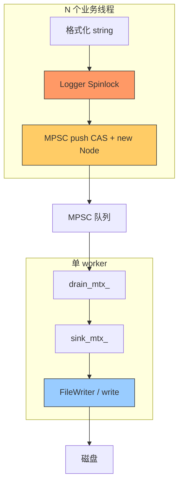

# Net 日志模块多线程性能分析报告

本文档总结 `module/net/log` 在多线程场景下的性能压测方法、指标含义、实测数据、瓶颈定位与优化建议。压测工具：`tests/net/bench_log_perf.cc`，产物输出目录：`bin/net/log/`（可通过环境变量 `NET_LOG_DIR` 覆盖）。

---

## 1. 背景与问题

在多线程压测中出现两类疑问：

1. **指标看起来「不合理」**：例如 4 线程与 1 线程总吞吐接近，但 `us/msg` 也接近，容易被误认为计算错误。
2. **线程增多后吞吐下降**：例如 async 8 线程总吞吐低于 4 线程，是否表示系统整体到瓶颈？

为区分 **Logger 锁竞争** 与 **写盘 / 异步 worker** 瓶颈，压测增加了 **shared**（共享 Logger + 单文件）与 **sharded**（每线程独立 Logger + 独立文件）两种布局对照。

---

## 2. 架构与数据路径

### 2.1 同步路径（sync）

```
业务线程 N
    │
    ▼
Logger::log()  ── Spinlock(mutex_) ── 遍历 Appender
    │
    ▼
FileLogAppender::log(async_mode=false)
    │
    ▼
格式化 LogFormatter → std::string
    │
    ▼
Spinlock(appender.mutex_) → ofstream << line → flush()
```

特点：业务线程在持锁期间完成格式化并写文件（或 flush），延迟直接体现在业务线程上。

### 2.2 异步路径（async）

```
业务线程 N
    │
    ▼
Logger::log()  ── Spinlock(mutex_)
    │
    ▼
FileLogAppender::log(async_mode=true) → AsyncEnqueueFile(path, line)
    │
    ▼
LockFreeMpscQueue::push  (每条约 new Node + CAS 队尾)
    │
    ▼
┌──────────────────────────────────────┐
│  AsyncLogManager 唯一 worker 线程     │
│  drain_mtx_ → try_pop → ingest()      │
│  sink_mtx_  → FileWriter::append      │
└──────────────────────────────────────┘
    │
    ▼
磁盘（按 path 分 FileWriter，但 drain/写缓冲仍串行化）
```

相关源码：

- `logger.cc`：`Logger::log` 持 `Spinlock` 后调用各 Appender。
- `lockfree_mpsc_queue.h`：无界 MPSC，**仅允许一个消费者**；多消费者须由 `drain_mtx_` 串行化。
- `async_sink.cc`：全局单队列 + 单 worker + `sink_mtx_` 保护 `writers_` 映射。

### 2.3 锁一览（均已改为 Spinlock）

| 位置 | 锁 | 作用 |
|------|-----|------|
| `Logger` | `mutex_` | 保护 appenders_、formatter_，每次 log 必抢 |
| `LogAppender` | `mutex_` | 同步写文件/stdout 时保护流 |
| `AsyncLogManager` | `sink_mtx_` | writers_、ByteBuffer append |
| `AsyncLogManager` | `drain_mtx_` | 串行化 MPSC 消费 |
| `LogConfig` / bridge | `mtx_` | 配置读写（非热路径） |

---

## 3. 压测方法

### 3.1 工具与命令

```bash
cd bin/net
cmake --build ../../build --target bench_log_perf

# 完整对比（shared + sharded，sync + async）
./bench_log_perf --threads 1,4,8 --msgs 50000 --payload 64

# 仅异步对照
./bench_log_perf --async-only --threads 1,4,8 --msgs 50000

# 快速冒烟
./bench_log_perf --quick --async-only
```

### 3.2 两种布局

| 布局 | 说明 | 目的 |
|------|------|------|
| **shared** | N 线程共用一个 `Logger`、写一个文件 | 模拟「全局根日志」；放大锁竞争 |
| **sharded** | 每线程独立 `Logger` + `bench_perf_sharded_*_w{i}.log` | 消除 Logger 级互斥，观察队列/worker/磁盘 |

### 3.3 指标定义（修复后）

| 指标 | 公式 | 含义 |
|------|------|------|
| **aggregate msg/s** | `总条数 / 墙钟时间` | 系统整体吞吐 |
| **per-thread msg/s** | `每线程条数 / 墙钟时间` | 单线程等价吞吐（多线程时 = aggregate / N） |
| **us/call (produce)** | `生产阶段墙钟 / 每线程条数` | 业务线程平均每次 `NET_LOG_INFO` 耗时（含等锁） |
| **flush** | 仅 async，生产结束后的 `AsyncLogMgr::flush()` | 把队列刷到文件的时间 |
| **lines** | 统计日志文件行数 | 须等于 `total`，用于校验是否真实落盘 |

**注意**：旧版 `us/msg = 墙钟/总条数` 在多线程下**不是**单次调用延迟，且当总吞吐不随线程线性增长时，该值会与单线程接近，造成误解。现已改为 `us/call = 墙钟/每线程条数`。

### 3.4 压测踩坑（已修复）

**在 `FileLogAppender` 已 `open` 文件后调用 `remove(path)`**：

- 写入进入已删除的 inode，路径上 `lines=0`，吞吐虚高（百万级 msg/s 但无文件）。
- **正确做法**：仅在 `new FileLogAppender` **之前** `remove`；打开后不再删除。

**日志文件 append 模式**：

- `FileLogAppender` 使用 `std::ios::app`，重复运行压测会在同一文件累加行数；每次 run 前对目标路径 `remove`。

---

## 4. 测试环境

| 项 | 值 |
|----|-----|
| CPU | 4 核，`aarch64` |
| 默认负载 | 每线程 50000 条，payload 64 字节，格式 `%m` |
| 输出目录 | `bin/net/log/`（`NET_LOG_DIR`） |

---

## 5. 实测数据

### 5.1 Async — shared（单 Logger + 单文件）

| 线程 | 总条数 | aggregate | per-thread | us/call | wall |
|------|--------|-----------|------------|---------|------|
| 1 | 50k | 157 万/s | 157 万/s | 0.64 μs | 31.8 ms |
| 4 | 200k | 207 万/s | 52 万/s | 1.93 μs | 96.8 ms |
| 8 | 400k | 193 万/s | 24 万/s | 4.15 μs | 207.4 ms |

现象：

- 总吞吐在 4 线程附近见顶，8 线程**不升反降**。
- `us/call` 随线程数近似线性恶化 → 典型**锁竞争 + 超订 CPU**。

### 5.2 Async — sharded（每线程 Logger + 文件）

| 线程 | aggregate | per-thread | us/call | wall | flush |
|------|-----------|------------|---------|------|-------|
| 1 | 229 万/s | 229 万/s | 0.43 μs | 21.8 ms | 0.1 ms |
| 4 | **390 万/s** | 98 万/s | 0.81 μs | 51.2 ms | 10.7 ms |
| 8 | **386 万/s** | 48 万/s | 1.42 μs | 103.7 ms | 32.7 ms |

对照 shared（8 线程）：

- 总吞吐约 **+100%**（193 万 → 386 万/s）。
- `us/call` 约 **降低 66%**（4.15 → 1.42 μs）。

结论：**去掉共享 Logger 后，8 线程总吞吐可维持在 4 线程水平**，说明此前「线程越多越慢」主要来自 **Logger 互斥**，而非磁盘绝对带宽耗尽。

### 5.3 Sync — shared（参考）

| 线程 | aggregate | us/call |
|------|-----------|---------|
| 1 | 160 万/s | 0.62 μs |
| 4 | 115 万/s | 3.48 μs |
| 8 | 72 万/s | 11.08 μs |

同步路径在业务线程直接 `flush` 文件，多线程共享一个 Appender 时锁 + IO 叠加，8 线程退化更明显。

---

## 6. 瓶颈分解



### 6.1 共享 Logger 锁（shared 主因）

`Logger::log` 全程持锁：

```cpp
MutexType::Lock lock(mutex_);
for (auto& app : appenders_) {
  app->log(self, level, event, async_mode_);
}
```

N 线程打同一条 logger 时，格式化 + 入队串行化，**总吞吐上限接近单线程**，`us/call` 随 N 增大。

**sharded 对照已证实**：每线程独立 Logger 后，8 线程 aggregate 仍可 ~386 万/s。

### 6.2 MPSC 多生产者竞争（仍存在）

每条日志 `push` 一次堆分配节点 + 原子 CAS 队尾。线程越多，缓存行竞争与 `malloc` 压力越大。sharded 8 线程 `us/call` 仍从 0.43 μs 升到 1.42 μs，部分来自此处。

### 6.3 单 consumer + 写路径串行（async 次因）

全局仅一个 worker 从队列 `drain`，`ingest` 内持 `sink_mtx_`。多文件时 worker 仍为**单线程顺序**处理队列中的记录；sharded 8 文件时 `flush` 升至 ~32.7 ms，体现落盘汇总成本。

### 6.4 CPU 超订

被测机 **4 核**，8 线程压测时 8 个生产者 + 1 worker + 主线程，调度切换与 cache 失效加重，shared 8 线程尤为明显。

### 6.5 磁盘

本压测 payload 小、行短，aggregate 数百万条/秒级，多为**缓冲写**；最终 `flush` 阶段才暴露多文件 fsync/写盘差异。生产环境大日志、慢盘时 worker/磁盘占比会上升。

---

## 7. 为何「线程多、吞吐低」—— 结论表

| 原因 | shared 表现 | sharded 表现 |
|------|-------------|--------------|
| Logger `mutex_` | 严重：8t 吞吐不增、us/call 4.15 μs | 基本消除 |
| MPSC 入队 | 有 | 有，但 us/call 仍可控 |
| 单 worker | 单文件时写盘串行 | 8 文件 flush 变长 |
| 4 核跑 8 线程 | 明显 | 仍存在 |

**一句话**：在当前实现下，多线程共用一个 Logger 写同一文件时，性能瓶颈主要是 **Logger 自旋锁**；异步只是把格式化后的写盘挪到 worker，**不能消除共享 Logger 上的串行点**。

---

## 8. 优化建议（按优先级）

### 8.1 业务与配置层（成本低）

1. **按模块/线程使用不同 Logger**，避免全局单例 + 单文件（与 sharded 压测一致）。
2. **线程数对齐 CPU 核数**，避免盲目 8 线程跑满 4 核。
3. 高频调试日志使用 **独立低级别 Logger** 或采样，减少热路径调用次数。

### 8.2 实现层（中期）

| 方向 | 说明 |
|------|------|
| 缩小 `Logger::log` 持锁范围 | 锁内仅拷贝 appender 列表或走 thread_local 缓存 |
| MPSC 节点池 | 避免每条 `new Node`，降低分配器竞争 |
| 按 path / shard 多队列多 worker | 消费并行化，匹配 sharded 写盘 |
| 批量 drain + 批量 append | 降低 `sink_mtx_` 获取次数 |

### 8.3 长期

- 无锁或 per-thread 缓冲队列，定时合并到 worker（类似双缓冲）。
- 慢盘场景：更大 `ByteBuffer`、更长 `flush_interval_ms`，权衡延迟与吞吐。

---

## 9. Spinlock 选型说明

日志热路径已从 `std::mutex` 换为 `pthread_spinlock`（`net::Spinlock`），适用于**临界区极短**（仅保护容器指针/列表）。  

注意：

- 临界区变长或竞争剧烈时，自旋会浪费 CPU，shared 8 线程即例证。
- `std::condition_variable` 不能与 Spinlock 配合；async worker 已改为 `atomic wake` + 定时 sleep。

---

## 10. 附录

### 10.1 日志文件命名

| 模式 | 示例 |
|------|------|
| shared sync | `bench_perf_shared_sync_4t.log` |
| shared async | `bench_perf_shared_async_8t.log` |
| sharded async | `bench_perf_sharded_async_8t_w0.log` … `_w7.log` |

### 10.2 相关文件

| 文件 | 说明 |
|------|------|
| `tests/net/bench_log_perf.cc` | 性能压测（shared/sharded） |
| `module/net/log/logger.cc` | Logger 锁与分发 |
| `module/net/log/async_sink.cc` | 异步队列与 worker |
| `module/net/log/lockfree_mpsc_queue.h` | MPSC 队列 |
| `module/net/thread/mutex.h` | Spinlock 定义 |
| `module/net/log/log_paths.h` | `NET_LOG_DIR` / `log/` 路径 |

### 10.3 复现对照实验

```bash
cd bin/net
./bench_log_perf --async-only --threads 4,8 --msgs 50000 --payload 64
```

关注输出中的：

```
[compare async thr=8] sharded vs shared: aggregate +100%   us/call 66% lower
```

即可快速验证「锁竞争 vs 写盘」占比。

---

*文档版本：与 bench_log_perf shared/sharded 对照及 Spinlock 改造后的代码一致。*
